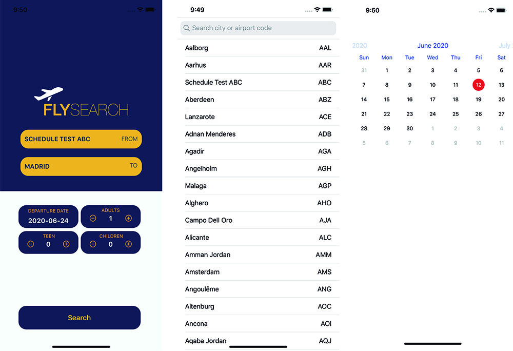

# FlySearch

It is a practice with the API that Ryanair which shows a list of airport stations and performs a selective search for flights according to the date entered

## Image Captures

## Build 

Xcode  Version 11.2.1
Swift version 5
iOS 13 or later
OS X 10.14.6
 

## Architecture Development and Decision Process

The default architecture is in MVC with the idea of scaling it in MVVC if development requires it. Codables Swift was used to manage the data models. The option of creating resources such as the format of dates to display and some other useful option is left for further development. Storyboars are used in your visual layer, including some adjustments to the root of the code. Insomnia similar to Postman is used for Api checks and SourceTree is used to commit to github.
As for libraries, it was only developed with the ones offered by apple, Foundation, UIkit and a dependency manager (Cocoapods FSCalendar) was included which offers a graphical calendar view to select the date.

## Deployment

Swift 5 
Xcode 11.2.1
OS X 10.14.6
Iiphone  11

## Run in Simulator Xcode

In Xcode Select Signing & Capabilities in Target of App
Adjust Team
Change Bundle Identifier

## Cocoapods

- FSCalendar

## Frameworks

- UIkit

## Attribution

API Data provided by Ryanair © 2020
